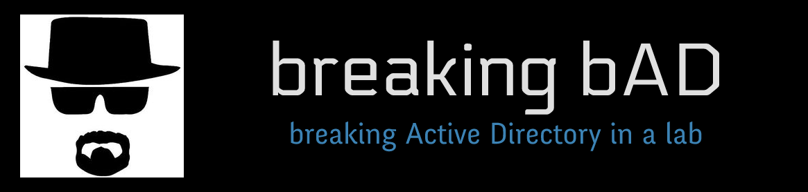

  I'm the one who pwns!
   
  
   

## About breakingbAD
breakingbAD is a plateform for cybersecurity enthusiasts to conduct vulnerability research in an easy and fast way. The current laboratory is Active Directory oriented.

## Main credits
This project wouldn't exist without [GOAD (Game of Active Directory)](https://github.com/Orange-Cyberdefense/GOAD). My laboratory is inspired by it (credits to [Mayfly](https://github.com/Mayfly277)) and I strongly recommend giving it a try.

## Features
### Vulnerabilities
The laboratory contains dangerous AD configurations as well as Windows vulnerabilities (related to patching).

To better name a vulnerability related to dangerous AD configurations, identifiers are used.

#### Dangerous configurations
- ID = 01 | ESC8
- ID = 02 | NTLMv1
- ID = 03 | WebClient
- ID = 04 | GPO
- ID = 05 | IPv6
- ID = 06 | LLMNR, NBT-NS & mDNS
- ID = 07 | Password in user's description
- ID = 08 | Kerberoasting
- ID = 09 | ASREProasting
- ID = 10 | ESC1
- ID = 11 | Anonymous Logon special group (inside the Pre-Windows 2000 Compatible Access group)

#### Patch-related vulnerabilities
- sAMAccountName spoofing
- ZeroLogon
- Certifried

### Machines
Currently, the 3 machines used are Windows Server 2019. The images are taken from [StefanScherer](https://app.vagrantup.com/StefanScherer/boxes/windows_2019/versions/2019.05.15) in version 2019.05.22.

### Technologies used
The laboratory make use of the following tools:

- Python
- Vagrant
- Ansible
- VirtualBox

## Getting started
See [Read the Docs](https://breakingbad.readthedocs.io/en/latest/index.html)
